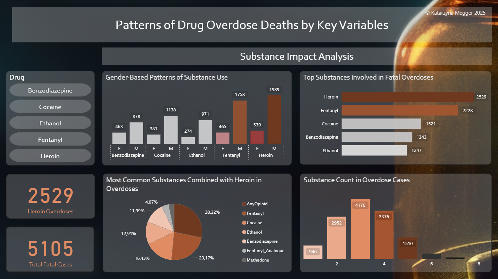
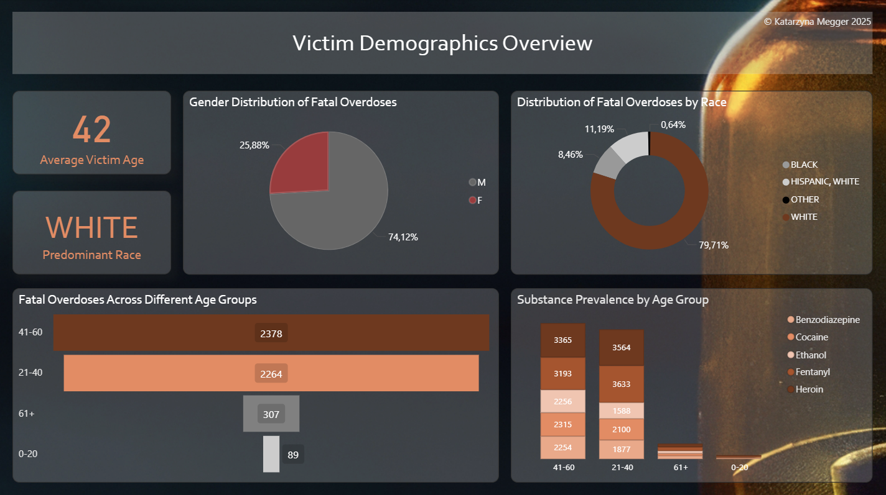
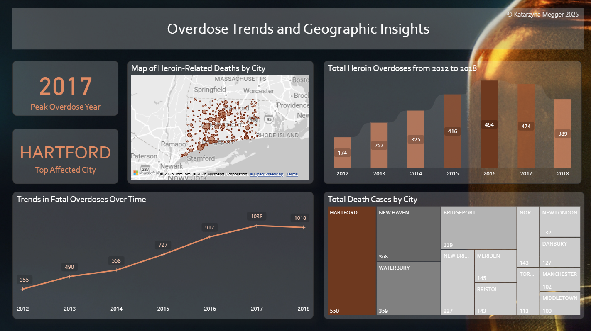

# Drug-Overdose-Analysis
Comprehensive analysis of fatal drug overdoses in Connecticut (2012–2018) using Python and Power BI . The project identifies temporal trends, geographic hotspots, and high-risk demographic profiles, with a specific focus on polydrug use patterns and the identification of lethal synergies between psychoactive substances.

🚀 About the Project

This project focuses on analyzing the escalation of the drug overdose crisis that took place between 2012 and 2018. 
The objective was to transform messy toxicology report data into actionable public health insights. The documentation showcases the entire analytical pipeline—from building automated Python processing pipelines (Pandas, Method Chaining) and advanced data cleaning to interactive visualization in Power BI. A key element of the analysis is identifying high-risk groups and examining "lethal synergies"—dangerous combinations of various psychoactive substances that drove fatality dynamics during the study period.

🎯 Project Goal

The primary objective is to analyze 5,105 unique fatal overdose cases to identify temporal trends, geographic hotspots (such as Hartford), and demographic profiles (sex, race, age) most affected by the crisis. A critical component of this study is the strict distinction between unique victims and the total number of substances identified in toxicology reports, ensuring an accurate assessment of the scale of the crisis.

📁 Data Model

The analysis is built on a comprehensive toxicology dataset from Connecticut (2012–2018), processed into a standardized and optimized dataframe (df_filled):
•	Unique Fatal Cases: 5,105 unique records representing individual victims.
•	Total Substance Mentions: 8,868 identified instances of drug presence across those cases.
•	Key Features: Includes age, sex, race, death city, and binary indicators (0/1) for 16 different substances, including Heroin, Fentanyl, and Cocaine.
•	Top 5 substances: A specialized attribute column created to categorize the primary substance involved in each case for hierarchical analysis.

⚙️ How to Run

Data Setup: Ensure drug_deaths.csv is available in the script's working directory.
Local use: Place the CSV in the same folder as the notebook.
Google Colab: Upload the CSV to the session storage before running the cells.
Execution: Run the notebook cells in sequence to initiate the Method Chaining pipeline and generate the ustandarized df_filled dataframe.

🔍 Scope Definition & Design Decisions

•	Data Integrity & Logic: A rigorous distinction is maintained between unique fatalities (5,105) and toxicological mentions (8,868). This discrepancy is explicitly addressed as a result of polydrug use (multiple substances detected per victim), preventing misinterpretation of the fatality rate.
•	Clinical Consistency: Records marked as "UNKNOWN" in demographic fields were excluded from specific visualizations to maintain a clean focus on primary trends without compromising the total case count.
•	Strategic Data Modeling: Age data was binned into four strategic categories (0-20, 21-40, 41-60, 61+) using pd.cut to improve the readability of trends across different life stages.
•	Geolocation Extraction: Regular Expressions (Regex) were utilized to extract precise Latitude and Longitude from raw text strings in the DeathCityGeo column for accurate geographic mapping.

🧠 Analysis Modules

1.	Toxicology Impact: Ranking the most frequent substances and analyzing the transition from Heroin-only cases to Fentanyl dominance.
2.	Lethal Synergy Analysis: Investigating co-occurrence patterns, specifically how often Heroin is combined with other opioids or non-opioid substances.
3.	Victim Demographics: Profiling victims by sex, race, and age group to identify high-risk populations.
4.	Spatiotemporal Trends: Mapping the escalation of the crisis from 2012 to 2018 and identifying regional hotspots.
   
🛠️ Python & Tech Techniques Used

•	Method Chaining: Structuring Pandas operations for clean, readable, and reproducible data transformation.
•	Regex (Regular Expressions): Extracting geographic coordinates and cleaning inconsistent text entries.
•	Data Wrangling: Bulk conversion of toxicology columns to the Int64 type and managing missing values across 42 raw data columns.
•	Visualization: Utilizing Matplotlib and Seaborn for detailed exploratory data analysis (EDA) prior to final reporting.

📊 Interactive Dashboard & Insights

The final analysis is presented via a three-page Power BI dashboard focusing on "Substance Impact," "Victim Demographics," and "Trends & Geography".
•	Substance Breakdown: Heroin remains the most frequent substance (2,529 cases), followed closely by Fentanyl (2,228 mentions).
•	Demographic Share: Males represent the vast majority of victims, accounting for 74.12% of the total cases.
•	Age Vulnerability: The 41–60 age group is the most affected, representing nearly half of all fatalities (2,378 cases).
•	Geographic Hotspots: Hartford was identified as the "Top Affected City" with 550 total fatalities.

Analysis of toxicological substance impact and lethal synergies.

Demographic profile of overdose victims.

Spatiotemporal trends and geographic hotspots.

-------------------------------------------------------------------------------- 
Author: Katarzyna Megger, 2026

